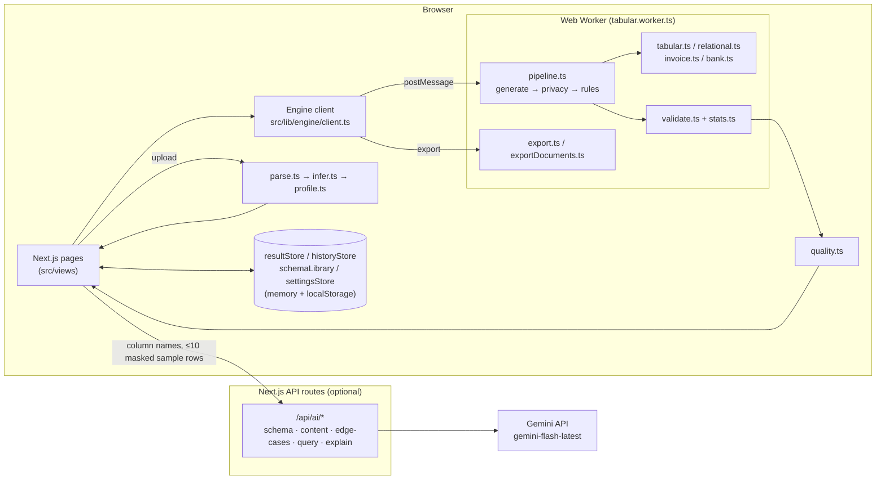

# ✦ Synthra

Synthra is a synthetic data platform that runs in the browser. Upload a sample file or describe a schema, and it
generates realistic fake data that keeps the statistics of the original but none of its private values. It then
shows how good that data is.

All generation, validation and export runs client-side, in a Web Worker. The only server code is an optional AI
layer: small Next.js API routes that call Google Gemini when a `GEMINI_API_KEY` is configured (a free Google AI Studio key works).

## Features

| Area | What it does |
| --- | --- |
| **Input** | CSV/JSON upload (up to 50 MB), a manual schema builder, "describe your data" in plain text, and saved schemas |
| **Schema inference** | Column types, date formats, semantic types (name, email, phone, city, currency, identifier…), privacy level, unique keys; foreign keys across several uploaded tables, including min/max children per parent |
| **Tabular generation** | Learns percentiles and category frequencies and preserves numeric correlations with a Gaussian copula. Configurable row count, seed, null rate, outlier rate and edge cases (boundaries, rare categories, long text, near-duplicates) |
| **Relational generation** | Several tables with 1:1, 1:N and N:N relationships (join tables are created automatically), zero orphan rows, and cross-table rules such as `orders.total = SUM(quantity × unit_price)` |
| **Documents** | Invoices with regional tax rules and templates (PK, IN, US, GB, DE, FR, CA, AU) and bank statements with running balances. Query-style input such as *"last 90 days, never below 500"* |
| **Privacy** | Per column: keep, synthetic replacement, masking, SHA-256 hashing, or Laplace noise with a privacy budget ε. Synthetic values are checked against the upload, so an original PII value is never reproduced |
| **Business rules** | Min/max ranges, allowed values, regex patterns and `column A < column B`, enforced during generation and verified afterwards |
| **Live preview** | 20 rows regenerated about 300 ms after any setting changes |
| **Validation & quality** | Row count, types, uniqueness, null rates, KS test, category TVD, correlation drift, referential integrity, totals, business rules, PII leaks. The Quality Observatory turns these into scores, and each score shows its formula and inputs |
| **Relationships** | Interactive ER diagram (React Flow + dagre): drag to create a relationship, and see the real edges and cardinalities |
| **Export** | CSV, JSON, SQL dump (CREATE TABLE + INSERT, with PK/FK), ZIP per table, PDF invoices, statements and quality report. Exports are byte-identical for the same seed |
| **History** | Every run is stored with its config, seed and learned statistics, so it can be regenerated exactly even after a reload |
| **AI (optional)** | Gemini reviews detected schemas, writes realistic free text for text columns, suggests edge cases, parses queries and explains quality scores. AI results carry an **AI** badge; without a key, the app says AI is unavailable and uses the rule-based engine |

## How it works



* **Deterministic:** every random choice comes from a seeded mulberry32 generator (`random.ts`), and each
  stage gets its own derived stream (`rng.derive('privacy')`). The same seed and config always produce the
  same bytes.
* **One pipeline:** the worker and the live preview both call `runTabularPipeline` / `runRelationalPipeline`,
  so the preview shows exactly what a full run will produce.
* **Nothing hardcoded:** every number on the Quality, Statistics and Validation screens is computed from the
  generated rows. When a metric cannot be computed (for example, fidelity without an uploaded file), it shows
  **N/A** and the reason. `mockData.ts` is used only by the "Load example" buttons.
* **Key safety:** `GEMINI_API_KEY` is read only in `src/lib/ai/server.ts`. The browser sends column names
  and at most 10 sample rows with detected PII masked. It never sends whole datasets.

## Safeguards against misuse

Invoices and bank statements are realistic enough for testing pipelines, so they are deliberately made
unusable as forgeries:

- **No real banks.** Every bank name is invented and labelled (e.g. "Test Bank Pakistan (Demo)",
  "Sample Savings Bank PK"). A test checks the list against real bank names.
- **Fake identifiers.** Every tax ID (NTN, GSTIN, VAT, EIN…) and account number starts with `TEST-`.
- **Watermark and footer.** Every PDF page and every on-screen preview carries a diagonal
  "SYNTHETIC — FOR TESTING ONLY" watermark and the footer "Generated by Synthra. Not a real
  financial document."
- **Marked exports.** JSON documents include `"synthetic": true` and a notice; CSV exports end with a
  `synthetic` column set to `true`.
- **Safe CSV.** Text cells starting with `=`, `+`, `-`, `@`, tab or carriage return are prefixed with `'`
  so spreadsheets open them as text instead of running them as formulas (plain numbers are unchanged).

## Project layout

```
src/
  app/                 Next.js routes, error pages, /api/ai/* route handlers
  components/          Layout (sidebar, top bar), common UI (Button, Modal, Toast, ErrorBoundary…)
  views/               Page components; views/workspace, views/quality, views/relationships
  lib/
    types.ts           All shared types
    engine/            Parsing, inference, generation, privacy, rules, validation, quality, export
    engine/__tests__/  Vitest unit tests
    ai/                Server-side Gemini helper + browser client
```

## Running it

Requirements: Node.js 20 or newer.

```bash
npm install
npm run dev          # http://localhost:3000
```

On Windows PowerShell, if scripts are blocked, use `npm.cmd run dev` (or run
`Set-ExecutionPolicy -Scope CurrentUser RemoteSigned` once).

Other scripts:

```bash
npm run build        # production build (type-checks everything)
npm start            # serve the production build
npm test             # Vitest unit tests for the engine
npm run test:watch   # tests in watch mode
```

### Enabling AI (optional)

```bash
cp .env.example .env.local
# edit .env.local:  GEMINI_API_KEY=your-key-from-aistudio.google.com
```

Get the key free at [aistudio.google.com](https://aistudio.google.com) → **Get API key** (no credit card).
Free-tier limits are per Google Cloud project and shown in AI Studio; when a limit is hit the app shows
"rate limited" and keeps working with the rule-based engine. On the free tier Google may use requests to
improve its products, so demo with test or public data (detected personal values are masked before sending
either way). Optionally pin a model with `GEMINI_MODEL=` in `.env.local`.

Then restart the dev server. The top-bar "Local engine" popover and **Settings → Engine & AI** show whether the
key was picked up. `.env.local` is git-ignored.

### AI cache and rate limit (optional, recommended on Vercel)

Every AI answer is cached for 7 days under a SHA-256 hash of the request, so asking the same question
again is instant and doesn't use Gemini quota. Each visitor may make 20 AI requests per minute per route.

- **With Upstash Redis** (`UPSTASH_REDIS_REST_URL` + `UPSTASH_REDIS_REST_TOKEN`, or the `KV_REST_API_URL` /
  `KV_REST_API_TOKEN` pair Vercel adds when you connect Upstash under **Storage**), the cache and the limit are
  shared by every server instance. This matters on Vercel, which runs many short-lived instances.
- **Without it**, both live in the server's memory, which is fine for local development.
- If Redis is unreachable, the app makes one quick attempt, then uses memory for a minute. AI never waits on Redis.
- Only a hash of the request and the model's answer are stored. The prompt itself, including any sample rows, is never stored.
  Upstash's free tier (256 MB, 500K commands/month) is far more than this app needs.

## Tests

`npm test` runs the unit tests in `src/lib/engine/__tests__/`:

| File | Covers |
| --- | --- |
| `tabular.test.ts` | Seeded RNG and derived streams, same seed → identical data, exact row counts, null rate within ±3 points, unique columns, value types |
| `relational.test.ts` | Parent-before-child order, zero orphan FKs (RI = 100), 1:N min/max, 1:1, N:N join tables, cycle rejection, order totals = Σ quantity × unit price |
| `documents.test.ts` | Invoice line/subtotal/tax/total arithmetic, regional templates, bank running and closing balances, "never below 500" query |
| `privacy.test.ts` | Masking formats, hash consistency, Laplace noise vs ε, no original PII values in output, leak detection |
| `quality.test.ts` | Each score formula with known inputs, N/A instead of invented numbers, null-rate drift lowers the score and raises a warning |
| `export.test.ts` | CSV BOM/CRLF/quoting (RFC 4180), JSON rows, SQL types, PK/FK, escaping, NULL, ISO dates, byte-identical CSV for the same seed |
