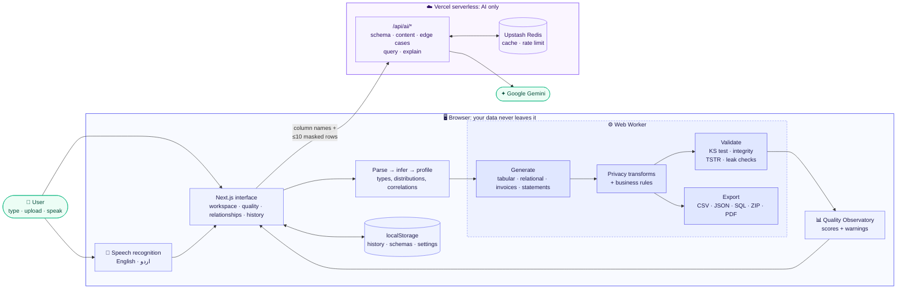
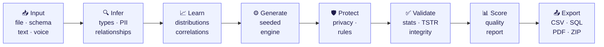

<div align="center">


# Synthra

**Realistic, privacy-safe synthetic data: tabular, relational and documents, generated in your browser.**


</div>

Teams need realistic data to build, test and demo software, but real data is sensitive, slow to get approved and
rarely covers the edge cases that break systems. **Synthra learns the shape of your data and generates a
statistically faithful copy that contains none of the original records.**

Upload a sample, design a schema, or simply describe what you need, in English or Urdu, by typing or speaking.
Synthra infers types and relationships, generates anything from a single table to a linked multi-table database
or a batch of invoices and bank statements, then **proves the result**: every quality and privacy score is
measured from the generated rows, never assumed.

Your data never leaves your device. The entire engine runs client-side in a Web Worker; the only server code is
a thin AI layer that sends Google Gemini column names and a few masked sample rows, never your dataset.

## Highlights

- **Private by design.** Generation, validation and export run in the browser. Personal values are masked
  before anything reaches the AI, and outputs are checked so no original personal value is ever reproduced.
- **Faithful, not random.** Learned distributions, preserved correlations, referential integrity and business
  rules, verified afterwards with statistical tests.
- **Measured quality.** A Quality Observatory scores fidelity, integrity, rules, uniqueness, nulls and privacy,
  and shows the formula behind every number.
- **Proven useful for ML.** A built-in TSTR test trains a model on synthetic data and checks it on real rows it
  has never seen, so you know the data teaches models what real data would.
- **Reproducible.** The same seed and settings always produce byte-identical exports.
- **Built-in safeguards.** Generated documents are watermarked and use fictional banks and `TEST-` identifiers,
  so they can't pass as real financial documents.

## Features

### Generate

| Feature | What it does |
| --- | --- |
| **Tabular data** | Learns percentiles and category frequencies, and keeps relationships between numbers, categories and yes/no columns with a Gaussian copula (e.g. *month-to-month customers churn more*). Generates up to 1M rows with your row count, seed, null rate, outlier rate and edge cases (boundaries, rare categories, long text, near-duplicates) |
| **Relational data** | Linked tables with 1:1, 1:N and N:N relationships (join tables created automatically), zero orphan rows, and cross-table rules such as `orders.total = SUM(quantity × unit_price)` |
| **Invoices** | Regional templates for PK, IN, US, GB, DE, FR, CA and AU: local currency, date format and tax label (GST, VAT, Sales Tax…), with line items, tax and totals that always reconcile |
| **Bank statements** | Realistic merchants and exact running balances, configured in plain language: *"last 90 days, savings account, never below 500"* |
| **Flexible input** | CSV/JSON upload (up to 50 MB), a manual schema builder, saved schemas, or a plain-language description, typed or spoken |

### Trust & quality

| Feature | What it does |
| --- | --- |
| **Privacy controls** | Per column: keep, synthetic replacement, masking, SHA-256 hashing, or Laplace noise with a privacy budget ε |
| **Validation** | Row counts, types, uniqueness, null rates, Kolmogorov–Smirnov test, category distance (TVD), correlation drift, referential integrity, totals, business rules and personal-data leak checks |
| **ML utility (TSTR)** | *Train on Synthetic, Test on Real*: holds out 25% of the upload, has a fresh generator learn from the rest, then trains a random forest on real vs synthetic rows and scores both on the held-out rows (AUC, accuracy or R²). Reports how much of the real model's skill above guessing the synthetic data keeps, and says *not reliable* instead of a number when even real data can't predict the target. One click from the results screen, with the likely outcome column (e.g. *churned*) pre-selected |
| **Quality Observatory** | Turns validation into scores with a radar chart, per-column real-vs-synthetic comparisons and severity-sorted warnings; exportable as a JSON or PDF report |
| **Business rules** | Min/max ranges, allowed values, regex patterns and `column A < column B`, enforced during generation and verified afterwards |
| **Misuse safeguards** | Fictional banks, `TEST-` tax IDs and account numbers, watermarked PDFs and previews, synthetic flags in exports, and CSV formula-injection protection |
| **Reproducibility** | Seeded generation and a run history that regenerates any dataset exactly |

### Experience

| Feature | What it does |
| --- | --- |
| **Guided workspace** | A six-step flow, Input → Schema → Configure → Generate → Validate → Export, with results you can review before exporting |
| **Live preview** | 20 sample rows regenerate about 300 ms after any setting changes |
| **Relationships diagram** | Interactive ER diagram: drag between columns to create relationships, and see cardinalities and integrity on every edge |
| **Voice input** | Speak your request in **English or Urdu (اردو)**; words appear live in the box, and Urdu digits are converted automatically |
| **Export** | CSV, JSON, SQL dump (`CREATE TABLE` + `INSERT` with primary and foreign keys), ZIP per table, and PDF invoices and statements |

### AI layer (Google Gemini)

| Feature | What it does |
| --- | --- |
| **Schema review** | Checks detected column meanings and personal data, and lets you choose where it disagrees |
| **Natural-language setup** | Turns a request in English, Urdu or Roman Urdu into a schema or statement settings |
| **Realistic content** | Writes natural free text (descriptions, notes, product names) and business-specific invoice items |
| **Edge-case suggestions** | Proposes data-specific edge cases (e.g. "order date before signup date") to inject |
| **Quality explanation** | Summarises the quality report in plain English and suggests what to change |
| **Built for reliability** | Answers cached for 7 days and rate-limited per visitor (Upstash Redis on Vercel); results carry an **AI** badge, and the built-in engine takes over quietly if AI is unavailable |

## How it works



Every dataset goes through the same pipeline:



* **Deterministic:** every random choice comes from a seeded mulberry32 generator (`random.ts`), and each
  stage gets its own derived stream (`rng.derive('privacy')`). The same seed and config always produce the
  same bytes.
* **One pipeline:** the worker and the live preview both call `runTabularPipeline` / `runRelationalPipeline`,
  so the preview shows exactly what a full run will produce.
* **Nothing hardcoded:** every number on the Quality, Statistics and Validation screens is computed from the
  generated rows. When a metric cannot be computed (for example, fidelity without an uploaded file), it shows
  **N/A** and the reason. `mockData.ts` is used only by the "Load example" buttons.
* **Key safety:** `GEMINI_API_KEY` is read only in `src/lib/ai/server.ts`. The browser sends column names
  and at most 10 sample rows with detected PII masked. It never sends whole datasets.

## Safeguards against misuse

Invoices and bank statements are realistic enough for testing pipelines, so they are deliberately made
unusable as forgeries:

- **No real banks.** Every bank name is invented and labelled (e.g. "Test Bank Pakistan (Demo)",
  "Sample Savings Bank PK"). A test checks the list against real bank names.
- **Fake identifiers.** Every tax ID (NTN, GSTIN, VAT, EIN…) and account number starts with `TEST-`.
- **Watermark and footer.** Every PDF page and every on-screen preview carries a diagonal
  "SYNTHETIC — FOR TESTING ONLY" watermark and the footer "Generated by Synthra. Not a real
  financial document."
- **Marked exports.** JSON documents include `"synthetic": true` and a notice; CSV exports end with a
  `synthetic` column set to `true`.
- **Safe CSV.** Text cells starting with `=`, `+`, `-`, `@`, tab or carriage return are prefixed with `'`
  so spreadsheets open them as text instead of running them as formulas (plain numbers are unchanged).

## Tech stack

| Layer | Technology |
| --- | --- |
| Framework | Next.js 16 (App Router), React 19, TypeScript |
| Styling & charts | Tailwind CSS 4, Recharts, React Flow + Dagre |
| Data engine | Web Worker, PapaParse, Faker.js, seeded mulberry32 RNG, Zod |
| Export | jsPDF + AutoTable, JSZip |
| AI & infrastructure | Google Gemini API, Upstash Redis, Vercel |
| Testing | Vitest (186 tests) |

## Project layout

```
src/
  app/                 Next.js routes, error pages, /api/ai/* route handlers
  components/          Layout (sidebar, top bar) and common UI (Button, Modal, Toast, VoiceInput…)
  views/               Pages: workspace, quality, relationships, history, datasets, settings, help
  lib/
    types.ts           Shared types
    engine/            Parsing, inference, generation, privacy, rules, validation, quality, export
    engine/__tests__/  Vitest unit tests
    ai/                Gemini client and server helper, cache and rate limit
    voice.ts           Voice input (English and Urdu)
```

## Getting started

Requirements: Node.js 20 or newer.

```bash
npm install
npm run dev          # http://localhost:3000
```

On Windows PowerShell, if scripts are blocked, use `npm.cmd run dev` (or run
`Set-ExecutionPolicy -Scope CurrentUser RemoteSigned` once).

```bash
npm run build        # production build (type-checks everything)
npm start            # serve the production build
npm test             # unit tests
npm run test:watch   # tests in watch mode
```

### Enabling AI

```bash
cp .env.example .env.local
# edit .env.local:  GEMINI_API_KEY=your-key-from-aistudio.google.com
```

Get a free key at [aistudio.google.com](https://aistudio.google.com) → **Get API key** (no credit card). Restart
the dev server, then check **Settings → Engine & AI**. `.env.local` is git-ignored, and the key is only ever read
on the server (`src/lib/ai/server.ts`).

- The default model is `gemini-flash-latest`; pin another with `GEMINI_MODEL=` in `.env.local`.
- Free-tier limits are per Google Cloud project and shown in AI Studio. When a limit is reached, the built-in
  engine takes over until it resets.
- On the free tier Google may use requests to improve its products, so use test or public data. Detected
  personal values are masked before sending either way.

### Voice input

The **Describe your dataset**, **Describe the statements** and **Seller's business** boxes have a microphone
button that uses the browser's built-in speech recognition: free, with words appearing as you speak.

- Works in Chrome, Edge and Safari; where the browser has no speech recognition (e.g. Firefox), the mic is hidden.
- The **EN | اردو** switch appears when AI is connected, since Gemini interprets Urdu and Roman Urdu requests.
- The browser asks for microphone permission once. Voice needs HTTPS (e.g. Vercel) or localhost, and an internet
  connection, because Chrome converts speech on Google's servers.

### Deploying to Vercel

1. Push the repository to GitHub, then **Add New → Project** in Vercel and import it. Next.js is detected
   automatically; no `vercel.json` is needed.
2. Under **Settings → Environment Variables**, add `GEMINI_API_KEY`.
3. Under **Storage**, create a free **Upstash Redis** database and connect it to the project.
4. Redeploy, then check **Settings → Engine & AI** in the app: *AI: Connected* and *Upstash Redis*.

## Tests

`npm test` runs 186 unit tests in `src/lib/engine/__tests__/`:

| File | Covers |
| --- | --- |
| `tabular.test.ts` | Seeded RNG and derived streams, same seed → identical data, exact row counts, null rates, unique columns, value types |
| `relational.test.ts` | Parent-before-child order, zero orphan foreign keys, 1:N min/max, 1:1, N:N join tables, cycle rejection, order totals |
| `documents.test.ts` | Invoice arithmetic, regional templates, running and closing balances, "never below 500" queries |
| `privacy.test.ts` | Masking formats, hash consistency, Laplace noise vs ε, no original personal values in output, leak detection |
| `quality.test.ts` | Each score formula with known inputs, N/A instead of invented numbers, drift lowers scores and raises warnings |
| `export.test.ts` | CSV (RFC 4180, BOM, CRLF), JSON, SQL types and keys, escaping, NULL, ISO dates, byte-identical output per seed |
| `safeguards.test.ts` | No real bank names, `TEST-` identifiers, watermark and footer on every PDF page, synthetic flags, CSV formula guard, date-range queries |
| `gemini.test.ts` | Gemini requests and error handling (invalid key, rate limit, safety block, timeout, firewall), JSON schema, every AI route; the schema review survives slow (20 s) and slightly off-list answers |
| `cache.test.ts` | Cache hits and misses, failures never cached, shared Redis cache, Redis outage fallback, 20-per-minute rate limit |
| `voice.test.ts` | Urdu digit conversion, transcript joining, Urdu detection, error messages |
| `tstr.test.ts` | TSTR targets (never IDs or personal data; outcome columns such as `churned` offered first), ≥ 85% utility on a churn dataset across seeds, R² and multi-class targets, "not reliable" for unpredictable targets, 75/25 holdout, reproducibility |
| `latent.test.ts` | Inverse normal accuracy, category relationships learned into the profile, generated data keeps "month-to-month customers churn more", old saved profiles generate exactly as before |
| `infer.test.ts` | Personal names detected by the word before "name" (`applicant_name`, `job_seeker_name`… are protected; `company_name`, `app_name`… are not people) |
| `store.test.ts` | Multi-file relational uploads keep every table in memory (6+ files), oldest dropped only past the limits |
| `rename.test.ts` | Saved history, schemas and settings carried over from the previous app name |
